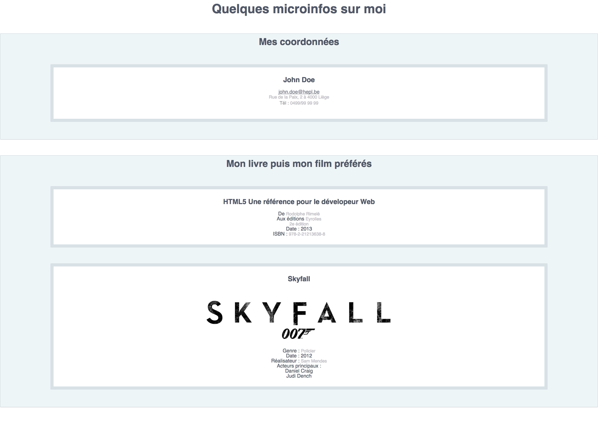
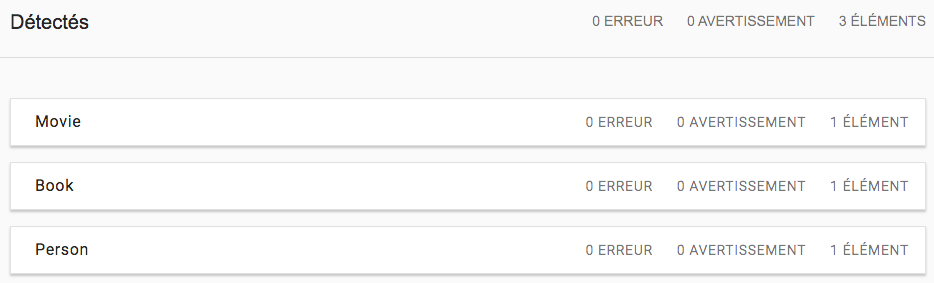
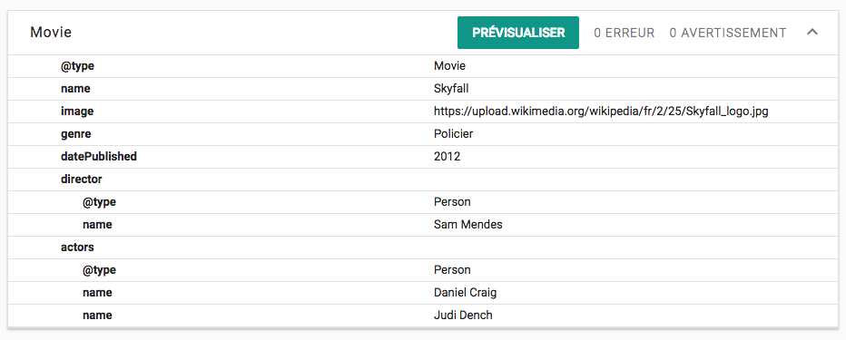
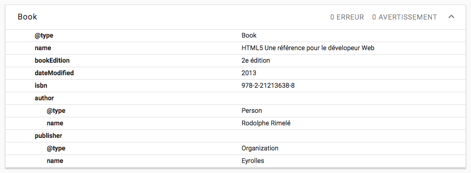
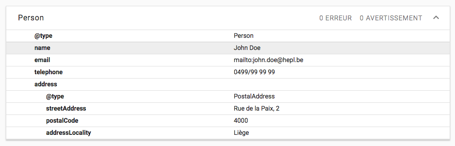

# "Quelques microinfos sur moi"

> HTML exercise given at HEPL

* * *

**"Formulaire d'inscription Web Shop"** is an educational project, which will be used for `HTML` remedial courses.

**Note:** the school where the course is given, the [HEPL](http://www.provincedeliege.be/hauteecole) from Liège, Belgium, is a french-speaking school. From this point, the instruction will be in french. Sorry.

* * *

> Lors de vos cours de *web*, vous allez découvrir les langages HTML et CSS et les mettre en pratique pour apprendre à créer des pages web.  

* * *

## Quelques microinfos sur moi

Vous trouverez dans ce dossier un fichier texte HTML nommé **index.html**. Cette page contient un document HTML5 présentant quelques informations à propos d'un mystérieux John qui aime James Bond et le HTML.

Votre but est d'ajouter à cette structure toutes les microdata présentes sur [schema.org](http://schema.org) qui sont nécessaires pour obtenir le résultat donné dans les quelques captures d'écrans suivantes, obtenues en copier-collant le code de la balise body comme &laquote;&nbsp;extrait de code&nbsp;&raquo; sur le site [http://www.google.com/webmasters/tools/richsnippets](http://www.google.com/webmasters/tools/richsnippets) qui permet de visualiser les données obtenues grâce aux microdata.

* * *

## Voici le partie visible de l'ice-berg&nbsp;:

### Rendu de index.html

* * *

## Et voici la partie immergée, pleine de microdata (rendues visibles via [http://www.google.com/webmasters/tools/richsnippets](http://www.google.com/webmasters/tools/richsnippets))&nbsp;:

### Liste des items détectés

### L'item Movie

### L'item Book

### L'item Person

* * *

#### Les attributs à utiliser (obligatoirement)&nbsp;:

- `itemscope`
- `itemtype`
- `itemprop`

Pour bien utiliser ces différents attributs, assurez-vous de bien comprendre leurs sémantiques et leurs utilisations.

* * *

Bon travail&nbsp;!